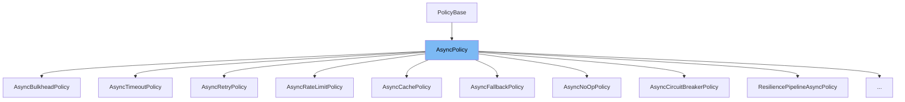

This document will cover the following topics related to the `AsyncPolicy` class:

1. What is `AsyncPolicy`?
2. Variables and functions in `AsyncPolicy`.
3. Usage example of `AsyncPolicy`.



# What is AsyncPolicy

`AsyncPolicy` is an abstract class in the Polly library that represents transient exception handling policies that can be applied to asynchronous delegates. It is used to define policies for handling exceptions and results in asynchronous operations.

<SwmSnippet path="/src/Polly/AsyncPolicy.TResult.cs" line="15">

---

# Variables and functions

The constructor `AsyncPolicy` initializes a new instance of the `AsyncPolicy` class. It takes two parameters: `exceptionPredicates` and `resultPredicates` which indicate which exceptions and results the policy should handle respectively.

```c#
    private protected AsyncPolicy(
        ExceptionPredicates exceptionPredicates,
        ResultPredicates<TResult> resultPredicates)
        : base(exceptionPredicates, resultPredicates)
    {
    }
```

---

</SwmSnippet>

<SwmSnippet path="/src/Polly/AsyncPolicy.TResult.cs" line="26">

---

Another constructor `AsyncPolicy` initializes a new instance of the `AsyncPolicy` class. It takes a `PolicyBuilder` object as a parameter which indicates which exceptions and results the policy should handle.

```c#
    protected AsyncPolicy(PolicyBuilder<TResult>? policyBuilder = null)
        : base(policyBuilder)
    {
    }
```

---

</SwmSnippet>

<SwmSnippet path="/src/Polly/CircuitBreaker/AsyncCircuitBreakerPolicy.cs" line="6">

---

# Usage example

`AsyncCircuitBreakerPolicy` is an example of how `AsyncPolicy` is used. It extends `AsyncPolicy` and implements `ICircuitBreakerPolicy`. The constructor initializes the `AsyncCircuitBreakerPolicy` with a `PolicyBuilder` and a `breakerController`.

```c#
public class AsyncCircuitBreakerPolicy : AsyncPolicy, ICircuitBreakerPolicy
{
    internal readonly ICircuitController<EmptyStruct> _breakerController;

    internal AsyncCircuitBreakerPolicy(
        PolicyBuilder policyBuilder,
        ICircuitController<EmptyStruct> breakerController)
        : base(policyBuilder) =>
        _breakerController = breakerController;
```

---

</SwmSnippet>

&nbsp;

*This is an auto-generated document by Swimm AI 🌊 and has not yet been verified by a human*

<SwmMeta version="3.0.0" repo-id="Z2l0aHViJTNBJTNBREVNTy1Qb2xseSUzQSUzQXN3aW1taW8=" repo-name="DEMO-Polly"><sup>Powered by [Swimm](/)</sup></SwmMeta>
