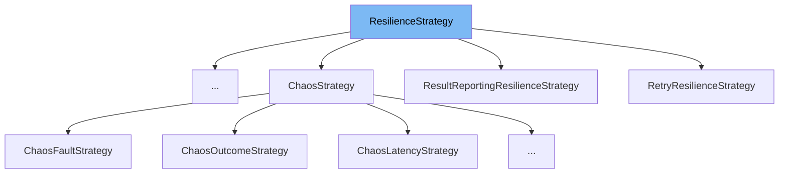

This document will cover the `ResilienceStrategy` class. We'll cover:

1. What is `ResilienceStrategy`
2. Variables and functions in `ResilienceStrategy`
3. Usage example of `ResilienceStrategy`



# What is ResilienceStrategy

`ResilienceStrategy` is a base strategy class used to simplify the implementation of generic (reactive) strategies by limiting the number of generic types the execute method receives. It is designed to handle all result types and is used to express resilience strategies such as Retry, Circuit Breaker, Hedging, Timeout, Rate Limiter, and Fallback in a fluent and thread-safe manner.

<SwmSnippet path="/src/Polly.Core/ResilienceStrategy.TResult.cs" line="27">

---

# Variables and functions

The function `ExecuteCore` is an abstract method that executes the specified user-provided callback. It returns an instance of a pending `ValueTask` for asynchronous executions or a completed `ValueTask` task for synchronous executions.

```c#
    protected internal abstract ValueTask<Outcome<TResult>> ExecuteCore<TState>(
        Func<ResilienceContext, TState, ValueTask<Outcome<TResult>>> callback,
        ResilienceContext context,
        TState state);
```

---

</SwmSnippet>

<SwmSnippet path="/src/Polly.Core/Retry/RetryResilienceStrategy.cs" line="30">

---

`RetryResilienceStrategy` class extends `ResilienceStrategy` and defines several variables such as `BaseDelay`, `MaxDelay`, `BackoffType`, `RetryCount`, `ShouldHandle`, `DelayGenerator`, `UseJitter`, and `OnRetry`. These variables are used to configure the retry strategy.

```c#
    public TimeSpan BaseDelay { get; }

    public TimeSpan? MaxDelay { get; }

    public DelayBackoffType BackoffType { get; }

    public int RetryCount { get; }

    public Func<RetryPredicateArguments<T>, ValueTask<bool>> ShouldHandle { get; }

    public Func<RetryDelayGeneratorArguments<T>, ValueTask<TimeSpan?>>? DelayGenerator { get; }

    public bool UseJitter { get; }

    public Func<OnRetryArguments<T>, ValueTask>? OnRetry { get; }
```

---

</SwmSnippet>

<SwmSnippet path="/src/Polly.Core/Retry/RetryResilienceStrategy.cs" line="46">

---

# Usage example

This is an example of how `ResilienceStrategy` is used in `RetryResilienceStrategy`. The `ExecuteCore` method is overridden to implement the retry logic. It executes the callback, checks if a retry should be performed based on the outcome and the retry count, and if so, it waits for a delay before retrying. If the maximum number of retries is reached or the operation is cancelled, it returns the outcome.

```c#
    protected internal override async ValueTask<Outcome<T>> ExecuteCore<TState>(Func<ResilienceContext, TState, ValueTask<Outcome<T>>> callback, ResilienceContext context, TState state)
    {
        double retryState = 0;

        int attempt = 0;

        while (true)
        {
            var startTimestamp = _timeProvider.GetTimestamp();
            var outcome = await StrategyHelper.ExecuteCallbackSafeAsync(callback, context, state).ConfigureAwait(context.ContinueOnCapturedContext);
            var shouldRetryArgs = new RetryPredicateArguments<T>(context, outcome, attempt);
            var handle = await ShouldHandle(shouldRetryArgs).ConfigureAwait(context.ContinueOnCapturedContext);
            var executionTime = _timeProvider.GetElapsedTime(startTimestamp);

            TelemetryUtil.ReportExecutionAttempt(_telemetry, context, outcome, attempt, executionTime, handle);

            if (context.CancellationToken.IsCancellationRequested || IsLastAttempt(attempt, out bool incrementAttempts) || !handle)
            {
                return outcome;
            }

```

---

</SwmSnippet>

&nbsp;

*This is an auto-generated document by Swimm AI 🌊 and has not yet been verified by a human*

<SwmMeta version="3.0.0" repo-id="Z2l0aHViJTNBJTNBREVNTy1Qb2xseSUzQSUzQXN3aW1taW8=" repo-name="DEMO-Polly"><sup>Powered by [Swimm](/)</sup></SwmMeta>
