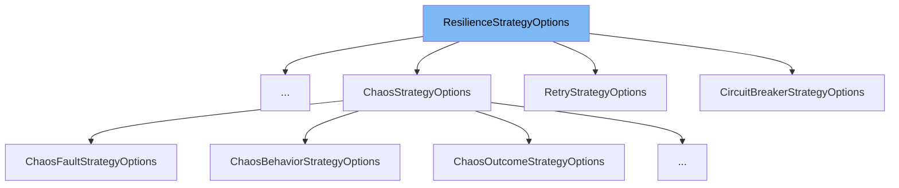

This document will cover the following topics related to the `ResilienceStrategyOptions` class:

1. What is `ResilienceStrategyOptions` and its purpose.
2. Variables and functions within `ResilienceStrategyOptions`.
3. An example of how `ResilienceStrategyOptions` is used in the `EmptyOptions` class.



# What is ResilienceStrategyOptions

`ResilienceStrategyOptions` is an abstract class that represents the options associated with an individual resilience strategy in the Polly library. It is used to define the name of the strategy, which uniquely identifies a particular instance of a specific strategy and is included in the telemetry produced by the individual resilience strategies.

<SwmSnippet path="/src/Polly.Core/ResilienceStrategyOptions.cs" line="16">

---

# Variables and functions

The `Name` property is a string that gets or sets the name of the strategy. This name uniquely identifies a particular instance of a specific strategy and is also included in the telemetry that is produced by the individual resilience strategies.

```c#
    public string? Name { get; set; }
```

---

</SwmSnippet>

<SwmSnippet path="/src/Polly.Core/ResiliencePipelineBuilderExtensions.cs" line="204">

---

# Usage example

`EmptyOptions` is an example of a class that extends `ResilienceStrategyOptions`. It is a sealed class that does not have any additional properties or methods. It is used as a default instance when no specific options are provided for a resilience strategy.

```c#
    internal sealed class EmptyOptions : ResilienceStrategyOptions
    {
        public static readonly EmptyOptions Instance = new();
    }
```

---

</SwmSnippet>

&nbsp;

*This is an auto-generated document by Swimm AI 🌊 and has not yet been verified by a human*

<SwmMeta version="3.0.0" repo-id="Z2l0aHViJTNBJTNBREVNTy1Qb2xseSUzQSUzQXN3aW1taW8=" repo-name="DEMO-Polly"><sup>Powered by [Swimm](/)</sup></SwmMeta>
