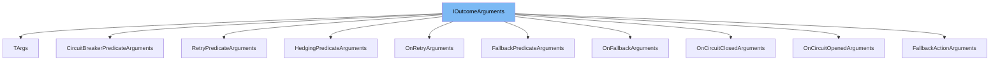

This document will cover the following aspects of the `IOutcomeArguments` interface:

1. What is `IOutcomeArguments`.
2. Variables and functions in `IOutcomeArguments`.
3. Usage example of `IOutcomeArguments`.



# What is IOutcomeArguments

`IOutcomeArguments` is an internal interface in the Polly library. It serves as a marker interface for outcome arguments, providing a standard way to access the resilience context and the outcome of a resilience operation.

<SwmSnippet path="/src/Polly.Core/Utils/IOutcomeArguments.cs" line="12">

---

# Variables and functions

`Context` is a property of the `IOutcomeArguments` interface. It provides access to the resilience context of the operation.

```c#
    ResilienceContext Context { get; }
```

---

</SwmSnippet>

<SwmSnippet path="/src/Polly.Core/Utils/IOutcomeArguments.cs" line="17">

---

`Outcome` is another property of the `IOutcomeArguments` interface. It provides access to the outcome of the resilience operation.

```c#
    Outcome<TResult> Outcome { get; }
```

---

</SwmSnippet>

<SwmSnippet path="/src/Polly.Core/Retry/OnRetryArguments.cs" line="12">

---

# Usage example

`OnRetryArguments` is a struct that implements the `IOutcomeArguments` interface. It represents the arguments used by `RetryStrategyOptions.OnRetry` for handling the retry event. It provides additional properties like `AttemptNumber`, `RetryDelay`, and `Duration` along with `Context` and `Outcome` from `IOutcomeArguments`.

```c#
public readonly struct OnRetryArguments<TResult> : IOutcomeArguments<TResult>
{
    /// <summary>
    /// Initializes a new instance of the <see cref="OnRetryArguments{TResult}"/> struct.
    /// </summary>
    /// <param name="outcome">The context in which the resilience operation or event occurred.</param>
    /// <param name="context">The outcome of the resilience operation or event.</param>
    /// <param name="attemptNumber">The zero-based attempt number.</param>
    /// <param name="retryDelay">The delay before the next retry.</param>
    /// <param name="duration">The duration of this attempt.</param>
    public OnRetryArguments(ResilienceContext context, Outcome<TResult> outcome, int attemptNumber, TimeSpan retryDelay, TimeSpan duration)
    {
        Context = context;
        Outcome = outcome;
        AttemptNumber = attemptNumber;
        RetryDelay = retryDelay;
        Duration = duration;
    }

    /// <summary>
    /// Gets the outcome that will be retried.
```

---

</SwmSnippet>

&nbsp;

*This is an auto-generated document by Swimm AI 🌊 and has not yet been verified by a human*

<SwmMeta version="3.0.0" repo-id="Z2l0aHViJTNBJTNBREVNTy1Qb2xseSUzQSUzQXN3aW1taW8=" repo-name="DEMO-Polly"><sup>Powered by [Swimm](/)</sup></SwmMeta>
