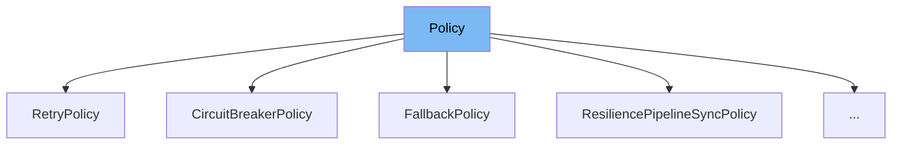

This document will cover the following aspects of the `Policy` class in the DEMO-Polly repository:

1. What is `Policy`.
2. Variables and functions in `Policy`.
3. Usage example of `Policy`.



# What is Policy

The `Policy` class in the DEMO-Polly repository is a part of the Polly library, which is a .NET resilience and transient-fault-handling library. The `Policy` class is used to specify the type of exception that the policy can handle and the type of return result that the policy can handle. It provides a fluent and thread-safe way to express resilience strategies such as Retry, Circuit Breaker, Hedging, Timeout, Rate Limiter, and Fallback.

<SwmSnippet path="/src/Polly/Policy.HandleSyntax.cs" line="10">

---

# Variables and functions

The function `Handle` is used to specify the type of exception that this policy can handle. It returns a `PolicyBuilder` instance for fluent chaining.

```c#
    public static PolicyBuilder Handle<TException>()
        where TException : Exception
        =>
        new(exception => exception is TException ? exception : null);
```

---

</SwmSnippet>

<SwmSnippet path="/src/Polly/Policy.HandleSyntax.cs" line="21">

---

The function `Handle` is an overloaded version that takes an exception predicate to filter the type of exception this policy can handle.

```c#
    public static PolicyBuilder Handle<TException>(Func<TException, bool> exceptionPredicate)
        where TException : Exception
        =>
        new(exception => exception is TException texception && exceptionPredicate(texception) ? exception : null);
```

---

</SwmSnippet>

<SwmSnippet path="/src/Polly/Policy.HandleSyntax.cs" line="31">

---

The function `HandleInner` is used to specify the type of exception that this policy can handle if found as an InnerException of a regular Exception, or at any level of nesting within an AggregateException.

```c#
    public static PolicyBuilder HandleInner<TException>()
        where TException : Exception
        =>
        new(PolicyBuilder.HandleInner(ex => ex is TException));
```

---

</SwmSnippet>

<SwmSnippet path="/src/Polly/Policy.HandleSyntax.cs" line="42">

---

The function `HandleInner` is an overloaded version that takes an exception predicate to filter the type of exception this policy can handle if found as an InnerException.

```c#
    public static PolicyBuilder HandleInner<TException>(Func<TException, bool> exceptionPredicate)
        where TException : Exception
        =>
        new(PolicyBuilder.HandleInner(ex => ex is TException texception && exceptionPredicate(texception)));
```

---

</SwmSnippet>

<SwmSnippet path="/src/Polly/Policy.HandleSyntax.cs" line="53">

---

The function `HandleResult` is used to specify the type of return result that this policy can handle with additional filters on the result.

```c#
    public static PolicyBuilder<TResult> HandleResult<TResult>(Func<TResult, bool> resultPredicate) =>
        new(resultPredicate);
```

---

</SwmSnippet>

<SwmSnippet path="/src/Polly/Policy.HandleSyntax.cs" line="63">

---

The function `HandleResult` is an overloaded version that takes a result value which the policy will handle.

```c#
    public static PolicyBuilder<TResult> HandleResult<TResult>(TResult result) =>
        HandleResult(new Func<TResult, bool>(r => (!Equals(r, default(TResult)) && r.Equals(result)) || (Equals(r, default(TResult)) && Equals(result, default(TResult)))));
```

---

</SwmSnippet>

<SwmSnippet path="/src/Polly/Utilities/Wrappers/ResiliencePipelineSyncPolicy.cs" line="3">

---

# Usage example

The `ResiliencePipelineSyncPolicy` class is an example of how to use the `Policy` class. It extends the `Policy` class and overrides the `Implementation` method to execute a resilience strategy.

```c#
internal sealed class ResiliencePipelineSyncPolicy : Policy
{
    private readonly ResiliencePipeline _pipeline;

    public ResiliencePipelineSyncPolicy(ResiliencePipeline strategy) => _pipeline = strategy;

    protected override void Implementation(Action<Context, CancellationToken> action, Context context, CancellationToken cancellationToken)
    {
        var resilienceContext = ResilienceContextFactory.Create(
            context,
            cancellationToken,
            true,
            out var oldProperties);

        try
        {
            _pipeline.Execute(
                static (context, state) =>
                {
                    state.action(state.context, context.CancellationToken);
                },
```

---

</SwmSnippet>

&nbsp;

*This is an auto-generated document by Swimm AI 🌊 and has not yet been verified by a human*

<SwmMeta version="3.0.0" repo-id="Z2l0aHViJTNBJTNBREVNTy1Qb2xseSUzQSUzQXN3aW1taW8=" repo-name="DEMO-Polly"><sup>Powered by [Swimm](/)</sup></SwmMeta>
