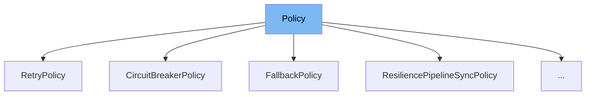

This document will cover the following aspects of the `Policy` class in the DEMO-Polly repo:

1. What is `Policy`.
2. Variables and functions in `Policy`.
3. Usage example of `Policy`.



# What is Policy

`Policy` is an abstract class in the DEMO-Polly repo that defines the implementation of a policy for synchronous executions. It is used to express resilience strategies in a fluent and thread-safe manner.

<SwmSnippet path="/src/Polly/Policy.SyncGenericImplementation.cs" line="12">

---

# Variables and functions

The `Implementation` function is an abstract method in the `Policy` class. It takes an action, a context, and a cancellation token as parameters. The action is the code to execute through the policy, the context is the policy execution context, and the cancellation token is used to signal that execution should be cancelled.

```c#
    protected abstract TResult Implementation(
        Func<Context, CancellationToken, TResult> action,
        Context context,
        CancellationToken cancellationToken);
```

---

</SwmSnippet>

<SwmSnippet path="/src/Polly/Utilities/Wrappers/ResiliencePipelineSyncPolicy.cs" line="5">

---

The `_pipeline` variable is a private readonly variable of type `ResiliencePipeline`. It is initialized in the constructor of `ResiliencePipelineSyncPolicy` class, which is a concrete implementation of the `Policy` class.

```c#
    private readonly ResiliencePipeline _pipeline;

    public ResiliencePipelineSyncPolicy(ResiliencePipeline strategy) => _pipeline = strategy;
```

---

</SwmSnippet>

<SwmSnippet path="/src/Polly/Utilities/Wrappers/ResiliencePipelineSyncPolicy.cs" line="9">

---

The `Implementation` function in `ResiliencePipelineSyncPolicy` class overrides the abstract `Implementation` function in `Policy` class. It creates a resilience context, executes the action through the pipeline, and finally cleans up the resilience context.

```c#
    protected override void Implementation(Action<Context, CancellationToken> action, Context context, CancellationToken cancellationToken)
    {
        var resilienceContext = ResilienceContextFactory.Create(
            context,
            cancellationToken,
            true,
            out var oldProperties);

        try
        {
            _pipeline.Execute(
                static (context, state) =>
                {
                    state.action(state.context, context.CancellationToken);
                },
                resilienceContext,
                (action, context));
        }
        finally
        {
            ResilienceContextFactory.Cleanup(resilienceContext, oldProperties);
```

---

</SwmSnippet>

<SwmSnippet path="/src/Polly/Utilities/Wrappers/ResiliencePipelineSyncPolicy.cs" line="33">

---

The `Implementation` function with a generic return type in `ResiliencePipelineSyncPolicy` class also overrides the abstract `Implementation` function in `Policy` class. It creates a resilience context, executes the action through the pipeline, and finally cleans up the resilience context. The result of the action execution is returned.

```c#
    protected override TResult Implementation<TResult>(Func<Context, CancellationToken, TResult> action, Context context, CancellationToken cancellationToken)
    {
        var resilienceContext = ResilienceContextFactory.Create(
            context,
            cancellationToken,
            true,
            out var oldProperties);

        try
        {
            return _pipeline.Execute(
                static (context, state) =>
                {
                    return state.action(state.context, context.CancellationToken);
                },
                resilienceContext,
                (action, context));
        }
        finally
        {
            ResilienceContextFactory.Cleanup(resilienceContext, oldProperties);
```

---

</SwmSnippet>

<SwmSnippet path="/src/Polly/Utilities/Wrappers/ResiliencePipelineSyncPolicy.cs" line="3">

---

# Usage example

`ResiliencePipelineSyncPolicy` is an example of how to use the `Policy` class. It extends the `Policy` class and provides concrete implementations for the `Implementation` functions. It uses a `ResiliencePipeline` to execute the action and handle resilience.

```c#
internal sealed class ResiliencePipelineSyncPolicy : Policy
{
    private readonly ResiliencePipeline _pipeline;

    public ResiliencePipelineSyncPolicy(ResiliencePipeline strategy) => _pipeline = strategy;

    protected override void Implementation(Action<Context, CancellationToken> action, Context context, CancellationToken cancellationToken)
    {
        var resilienceContext = ResilienceContextFactory.Create(
            context,
            cancellationToken,
            true,
            out var oldProperties);

        try
        {
            _pipeline.Execute(
                static (context, state) =>
                {
                    state.action(state.context, context.CancellationToken);
                },
```

---

</SwmSnippet>

&nbsp;

*This is an auto-generated document by Swimm AI 🌊 and has not yet been verified by a human*

<SwmMeta version="3.0.0" repo-id="Z2l0aHViJTNBJTNBREVNTy1Qb2xseSUzQSUzQXN3aW1taW8=" repo-name="DEMO-Polly"><sup>Powered by [Swimm](/)</sup></SwmMeta>
