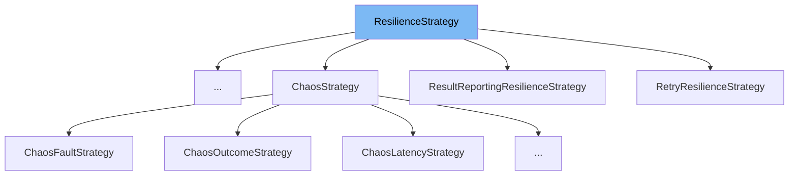

This document will cover the `ResilienceStrategy` class in the DEMO-Polly repo. We will discuss:

1. What the `ResilienceStrategy` class is and its purpose.
2. The variables and functions within the `ResilienceStrategy` class.
3. An example of how to use the `ResilienceStrategy` class in `RetryResilienceStrategy`.



# What is ResilienceStrategy

`ResilienceStrategy` is a base strategy class used to simplify the implementation of generic (reactive) strategies by limiting the number of generic types the execute method receives. It is designed to handle all result types and is used to execute a specified callback in a reactive resilience strategy.

<SwmSnippet path="/src/Polly.Core/ResilienceStrategy.TResult.cs" line="27">

---

# Variables and functions

The function `ExecuteCore` is an abstract method that executes the specified callback. It takes a callback, a context, and a state as parameters and returns a `ValueTask` of `Outcome<TResult>`. The callback never throws an exception, instead, the exception is captured and converted to an `Outcome<TResult>`.

```c#
    protected internal abstract ValueTask<Outcome<TResult>> ExecuteCore<TState>(
        Func<ResilienceContext, TState, ValueTask<Outcome<TResult>>> callback,
        ResilienceContext context,
        TState state);
```

---

</SwmSnippet>

<SwmSnippet path="/src/Polly.Core/Retry/RetryResilienceStrategy.cs" line="30">

---

`RetryResilienceStrategy` class has several variables such as `BaseDelay`, `MaxDelay`, `BackoffType`, `RetryCount`, `ShouldHandle`, `DelayGenerator`, and `UseJitter`. These variables are used to configure the retry strategy.

```c#
    public TimeSpan BaseDelay { get; }

    public TimeSpan? MaxDelay { get; }

    public DelayBackoffType BackoffType { get; }

    public int RetryCount { get; }

    public Func<RetryPredicateArguments<T>, ValueTask<bool>> ShouldHandle { get; }

    public Func<RetryDelayGeneratorArguments<T>, ValueTask<TimeSpan?>>? DelayGenerator { get; }

    public bool UseJitter { get; }

    public Func<OnRetryArguments<T>, ValueTask>? OnRetry { get; }
```

---

</SwmSnippet>

<SwmSnippet path="/src/Polly.Core/Retry/RetryResilienceStrategy.cs" line="46">

---

The `ExecuteCore` function in `RetryResilienceStrategy` class is an override of the `ExecuteCore` function in `ResilienceStrategy` class. It executes the callback and handles the retry logic based on the retry strategy configuration.

```c#
    protected internal override async ValueTask<Outcome<T>> ExecuteCore<TState>(Func<ResilienceContext, TState, ValueTask<Outcome<T>>> callback, ResilienceContext context, TState state)
    {
        double retryState = 0;

        int attempt = 0;

        while (true)
        {
            var startTimestamp = _timeProvider.GetTimestamp();
            var outcome = await StrategyHelper.ExecuteCallbackSafeAsync(callback, context, state).ConfigureAwait(context.ContinueOnCapturedContext);
            var shouldRetryArgs = new RetryPredicateArguments<T>(context, outcome, attempt);
            var handle = await ShouldHandle(shouldRetryArgs).ConfigureAwait(context.ContinueOnCapturedContext);
            var executionTime = _timeProvider.GetElapsedTime(startTimestamp);

            TelemetryUtil.ReportExecutionAttempt(_telemetry, context, outcome, attempt, executionTime, handle);

            if (context.CancellationToken.IsCancellationRequested || IsLastAttempt(attempt, out bool incrementAttempts) || !handle)
            {
                return outcome;
            }

```

---

</SwmSnippet>

<SwmSnippet path="/src/Polly.Core/Retry/RetryResiliencePipelineBuilderExtensions.cs" line="30">

---

# Usage example

Here is an example of how `ResilienceStrategy` is used in `RetryResilienceStrategy`. The `AddStrategy` method is called with a function that creates a new instance of `RetryResilienceStrategy`.

```c#
        return builder.AddStrategy(
            context => new RetryResilienceStrategy<object>(options, context.TimeProvider, context.Telemetry),
            options);
```

---

</SwmSnippet>

&nbsp;

*This is an auto-generated document by Swimm AI 🌊 and has not yet been verified by a human*

<SwmMeta version="3.0.0" repo-id="Z2l0aHViJTNBJTNBREVNTy1Qb2xseSUzQSUzQXN3aW1taW8=" repo-name="DEMO-Polly"><sup>Powered by [Swimm](/)</sup></SwmMeta>
