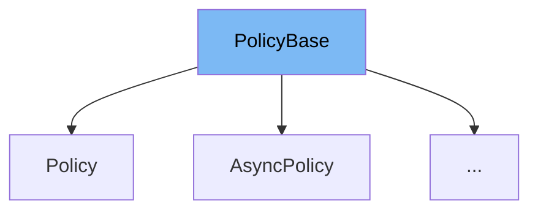

This document will cover the `PolicyBase` class in the DEMO-Polly repository. We'll cover:

1. What is `PolicyBase`.
2. Variables and functions in `PolicyBase`.
3. An example of how to use `PolicyBase`.



# What is PolicyBase

`PolicyBase` is an abstract class in the Polly library. It is designed to provide a base for all policy classes in the library. It contains key properties and methods that are common to all policies.

<SwmSnippet path="/src/Polly/PolicyBase.ContextAndKeys.cs" line="8">

---

# Variables and functions

The variable `policyKeyInternal` is used to store a key unique to each `IsPolicy` instance. It is accessed through the `PolicyKey` property, which generates a default value if `policyKeyInternal` is null.

```c#
    protected string policyKeyInternal;

    /// <summary>
    /// Gets a key intended to be unique to each <see cref="IsPolicy"/> instance, which is passed with executions as the <see cref="Context.PolicyKey"/> property.
    /// </summary>
    public string PolicyKey => policyKeyInternal ?? (policyKeyInternal = GetType().Name + "-" + KeyHelper.GuidPart());

```

---

</SwmSnippet>

<SwmSnippet path="/src/Polly/PolicyBase.ContextAndKeys.cs" line="15">

---

The function `PolicyKeyMustBeImmutableException` is used to throw an exception when there is an attempt to change the `PolicyKey` after it has been set.

```c#
    internal static ArgumentException PolicyKeyMustBeImmutableException(string policyKeyParamName) => new("PolicyKey cannot be changed once set; or (when using the default value after the PolicyKey property has been accessed.", policyKeyParamName);
```

---

</SwmSnippet>

<SwmSnippet path="/src/Polly/PolicyBase.ContextAndKeys.cs" line="23">

---

The function `RestorePolicyContext` is used to restore the `PolicyWrapKey` and `PolicyKey` to their prior values in the execution context.

```c#
    internal static void RestorePolicyContext(Context executionContext, string priorPolicyWrapKey, string priorPolicyKey)
    {
        executionContext.PolicyWrapKey = priorPolicyWrapKey;
        executionContext.PolicyKey = priorPolicyKey;
    }
```

---

</SwmSnippet>

<SwmSnippet path="/src/Polly/PolicyBase.ContextAndKeys.cs" line="35">

---

The function `SetPolicyContext` is used to update the execution context with the `PolicyKey` of the executing policy, while preserving the prior `PolicyWrapKey` and `PolicyKey`.

```c#
    internal virtual void SetPolicyContext(Context executionContext, out string priorPolicyWrapKey, out string priorPolicyKey) // priorPolicyWrapKey and priorPolicyKey could be handled as a (string, string) System.ValueTuple return type instead of out parameters, when our minimum supported target supports this.
    {
        priorPolicyWrapKey = executionContext.PolicyWrapKey;
        priorPolicyKey = executionContext.PolicyKey;

        executionContext.PolicyKey = PolicyKey;
    }
```

---

</SwmSnippet>

<SwmSnippet path="/src/Polly/Policy.cs" line="7">

---

# Usage example

The `Policy` class is an example of a class that extends `PolicyBase`. It uses the base constructor to initialize its `exceptionPredicates` and provides additional constructors for more specific use cases.

```c#
public abstract partial class Policy : PolicyBase
{
    /// <summary>
    /// Initializes a new instance of the <see cref="Policy"/> class.
    /// </summary>
    /// <param name="exceptionPredicates">Predicates indicating which exceptions the policy should handle. </param>
    private protected Policy(ExceptionPredicates exceptionPredicates)
        : base(exceptionPredicates)
    {
    }

    /// <summary>
    /// Initializes a new instance of the <see cref="Policy"/> class.
    /// </summary>
    /// <param name="policyBuilder">A <see cref="PolicyBuilder"/> specifying which exceptions the policy should handle. </param>
    protected Policy(PolicyBuilder? policyBuilder = null)
        : base(policyBuilder)
    {
    }
}
```

---

</SwmSnippet>

&nbsp;

*This is an auto-generated document by Swimm AI 🌊 and has not yet been verified by a human*

<SwmMeta version="3.0.0" repo-id="Z2l0aHViJTNBJTNBREVNTy1Qb2xseSUzQSUzQXN3aW1taW8=" repo-name="DEMO-Polly"><sup>Powered by [Swimm](/)</sup></SwmMeta>
