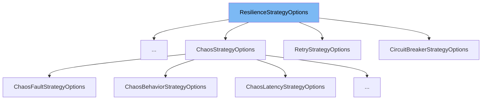

This document will cover the `ResilienceStrategyOptions` class. We will cover:

1. What the `ResilienceStrategyOptions` class is.
2. `ResilienceStrategyOptions` class main variables and functions.
3. Example of how to use the `ResilienceStrategyOptions` class.



# What is ResilienceStrategyOptions

`ResilienceStrategyOptions` is an abstract class that provides a base for options associated with individual resilience strategies in the Polly library. It is used to define common properties that are shared across different resilience strategies.

<SwmSnippet path="/src/Polly.Core/ResilienceStrategyOptions.cs" line="16">

---

# Variables and functions

The `Name` variable is used to store the name of the strategy. This name uniquely identifies a particular instance of a specific strategy and is also included in the telemetry that is produced by the individual resilience strategies.

```c#
    public string? Name { get; set; }
```

---

</SwmSnippet>

<SwmSnippet path="/src/Polly.Core/Hedging/HedgingStrategyOptions.TResult.cs" line="9">

---

# Usage example

`HedgingStrategyOptions` is an example of a class that extends `ResilienceStrategyOptions`. It defines additional properties specific to the hedging strategy, such as `Delay`, `MaxHedgedAttempts`, `ShouldHandle`, `ActionGenerator`, `DelayGenerator`, and `OnHedging`. These properties control the behavior of the hedging strategy, such as the maximum waiting time before spawning a new hedged action, the maximum number of hedged actions to use, and the conditions under which the hedging should be executed.

```c#
public class HedgingStrategyOptions<TResult> : ResilienceStrategyOptions
{
    /// <summary>
    /// Initializes a new instance of the <see cref="HedgingStrategyOptions{TResult}"/> class.
    /// </summary>
    public HedgingStrategyOptions() => Name = HedgingConstants.DefaultName;

    /// <summary>
    /// Gets or sets the maximum waiting time before spawning a new hedged action.
    /// </summary>
    /// <remarks>
    /// You can use <see cref="TimeSpan.Zero"/> to create all hedged actions (value of <see cref="MaxHedgedAttempts"/>) at once
    /// or <see cref="System.Threading.Timeout.InfiniteTimeSpan"/> to force the hedging strategy to never create new action before the old one is finished.
    /// <para> If you want a greater control over hedging delay customization use <see cref="DelayGenerator"/>.</para>
    /// </remarks>
    /// <value>
    /// The default value is 2 seconds.
    /// </value>
    public TimeSpan Delay { get; set; } = HedgingConstants.DefaultHedgingDelay;

    /// <summary>
```

---

</SwmSnippet>

&nbsp;

*This is an auto-generated document by Swimm AI 🌊 and has not yet been verified by a human*

<SwmMeta version="3.0.0" repo-id="Z2l0aHViJTNBJTNBREVNTy1Qb2xseSUzQSUzQXN3aW1taW8=" repo-name="DEMO-Polly"><sup>Powered by [Swimm](/)</sup></SwmMeta>
